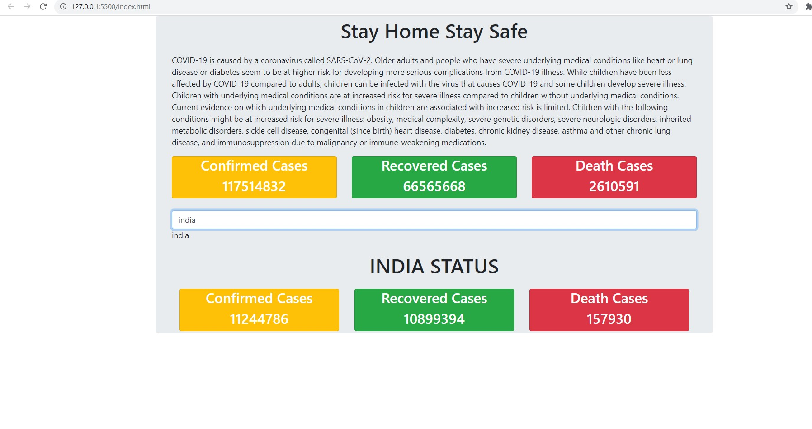

- adding input data for user

```text
<input type="text"
            class="form-control mt-4"
            placeholder="enter country here"
            ng-model="c"
            ng-change="get_c_data()"
            />
        
            {{c}}

```
```javascript

 // get country data

    $scope.get_c_data = () => {

        console.log($scope.c); 
        

    };

```
- whatever we are typing here we can print in c. 
- next we can get this input data in myscript.js
- with ng-change , whenever we are changin value , then get_c_data() will be called. 
- in inspect mode we can check whatever we are typing we get in console log 
- $scope.c is where we can obtain counrtr data. 


- Next we can get country data from api as follows: 

```javascript

// get country data

    $scope.get_c_data = () => {

        console.log($scope.c); 
        let country = $scope.c; 
        if (country==""){
            return "";
        }

 
    $http.get(`${URL}/countries/${country}`).then((result) => {

        // success  code here 
        console.log("success code here for country");
        console.log(result.data);
        $scope.c_data= result.data;
        
    }).catch((err) => {

        // error  code here
        console.log("error code here");
        console.log(err);

        
    })

};
```

- Next we will use above data to display in html 

```html
    <!-- Adding C data here-->
          <div class="container-fluid" ng-if="c_data"> 
          <h1 class="text-center mt-4 text-uppercase">{{c}} status</h1>
           
          <div class="row text-center mt-4" ng-if="c_data">
           <div class="col-md-4">
               <div class="card bg-warning text-white">
                   <h3>Confirmed Cases</h3>
                   <h3>{{c_data.confirmed.value}}</h3>
               </div>

           </div>
           <div class="col-md-4">
              <div class="card bg-success text-white">
                  <h3>Recovered Cases</h3>
                  <h3>{{c_data.recovered.value}}</h3>
              </div>

           </div>
           <div class="col-md-4">
              <div class="card bg-danger text-white">
                  <h3>Death Cases</h3>
                  <h3>{{c_data.deaths.value}}</h3>
              </div>

           </div>
       </div>

    </div>
```

- final output for http://127.0.0.1:5500/index.html will be as follows: 

